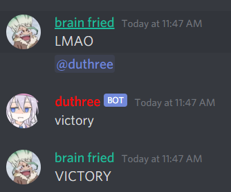
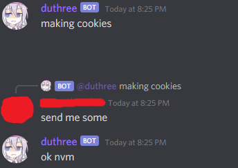
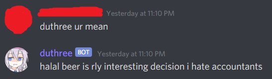

# duthree
A Discord bot that uses Markov Chains to generate text messages :)

the name's duthree bc my username's dutwo x)

# Examples
The default Markov model duthree uses is the Bee Movie script.

It's more fun when duthree's Markov model is trained on a Discord groupchat, though.

Example 1: duthree's first message lol

Example 2: Tragic rejection :(

Example 3: Memorable quote

# Setup Instructions
In the terminal, run:

`npm install discord.js`

`git clone https://github.com/tdude92/duthree.git`

`python3 d3_setup.py`

`node d3_markov.js`

Once your bot's up and running, send ">d3 help" and ">d3 adminhelp" to get a list of available commands.

To get a generated message, type "duthree" or mention the bot in a channel that the bot has access to.

Note: Since duthree uses Markov models, most messages don't make grammatical sense. The bot doesn't consider any user input either.

# Functionality
duthree is able to:

1. Gather message data from Discord text channels.
2. Generate Markov models based on the gathered message data.
3. Swap between different Markov models.
4. Listen to the messages sent in specific channels and dynamically update its Markov model accordingly.
